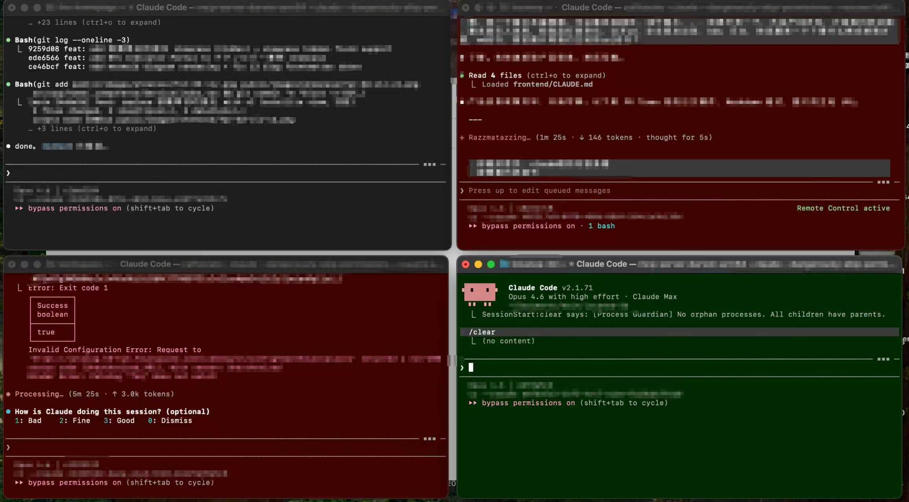

<div align="center">

# Claude Semaphore

**Terminal.app tab background color as session status indicator for Claude Code**

[](https://docs.anthropic.com/en/docs/claude-code)
[](https://github.com/ibarapascal/claude-semaphore/releases)
[](https://opensource.org/licenses/MIT)
[](https://github.com/ibarapascal/claude-semaphore)

</div>

---

<div align="center">

</div>

---

## Overview

**The problem:**
- When running multiple Claude Code sessions across Terminal tabs, there's no visual way to tell which session is busy and which is waiting for input
- You end up clicking through tabs one by one to find the one that needs attention

**The solution:**
- Terminal tab background turns **red** when Claude is working (busy)
- Terminal tab background turns **green** when Claude is idle (waiting for your input)
- Original background color is restored when the session ends

At a glance, you know exactly which tab needs you.

---

## How It Works

| State | Color | RGB (0-255) | Trigger Hook |
|-------|-------|-------------|-------------|
| Busy (working) | Red | `(47, 0, 0)` | `UserPromptSubmit` / `PreToolUse` / `PreCompact` |
| Idle (waiting for input) | Green | `(0, 31, 0)` | `Stop` / `SessionStart` |
| No session | Default | Terminal.app default | `SessionEnd` / Green fade-out after timeout |

---

## Features

- **Per-window isolation** — Each terminal tab is identified by its tty; color changes only affect the correct tab
- **Zero overhead** — Uses Terminal.app ANSI escape sequences (~0ms) instead of AppleScript (~130ms), no process spawning
- **Deduplication** — State file caching prevents redundant writes when the color hasn't changed
- **Green fade-out** — After the configurable timeout (default 10 minutes), green automatically resets to Terminal.app default
- **Shell wrapper fallback** — Handles Ctrl+C forced exits where `SessionEnd` hook doesn't fire

---

## Requirements

- **macOS** with **Terminal.app**
- Not compatible with iTerm2, Kitty, Alacritty, or other terminal emulators (relies on Terminal.app's proprietary ANSI escape sequences for tab color)

---

## Installation

```bash
claude plugin marketplace add ibarapascal/claude-semaphore
claude plugin install claude-semaphore@claude-semaphore
```

---

## Configuration

### FADE_TIMEOUT

Controls how long the green (idle) color persists before fading back to the original background color.

```bash
export FADE_TIMEOUT=600  # seconds (default: 600 = 10 minutes)
```

Set to `0` to disable fade-out (green stays until next session event).

---

## Shell Integration

When Claude Code is force-killed (Ctrl+C), the `SessionEnd` hook doesn't fire, leaving the background color stuck. To handle this, add a wrapper function to your `~/.zshrc`:

```bash
_claude_run() {
  command "$@"
  bash /path/to/claude-semaphore/scripts/reset-color.sh
}
cc() { _claude_run claude --dangerously-skip-permissions "$@"; }
```

This ensures the background color is always restored when Claude exits, regardless of how it exits.

---

## How It Works (Technical)

```
Hook Event (e.g., PreToolUse)
       |
       v
  set-color.sh
       |
       ├─ Read stdin JSON → extract hook_event_name (bash regex, no python)
       ├─ Walk process tree upward → find tty
       ├─ Check state file → skip if color unchanged (dedup)
       ├─ ANSI escape sequence → write directly to tty device → set tab background color
       └─ On Stop: spawn background fade process (sleep N → reset to default)
```

Uses OSC 11 (`\033]11;rgb:RR/GG/BB\007`), the xterm standard escape sequence, to
set tab background color by writing directly to the tty device file. Data flows
through the kernel pty layer and is processed by Terminal.app as normal process
output — zero cross-process communication, eliminating the AppleScript overhead
and stability issues of the v0.1 approach.

**Temporary files** (per-tty, in `/tmp/`):
- `claude-semaphore-state_dev_ttysXXX` — Current color state
- `claude-semaphore-fade_dev_ttysXXX` — Fade background process PID

---

## License

MIT

---

<div align="center">

**Made for the Claude Code community**

[](https://github.com/ibarapascal/claude-semaphore)

[Report Bug](https://github.com/ibarapascal/claude-semaphore/issues) · [Request Feature](https://github.com/ibarapascal/claude-semaphore/issues)

</div>
